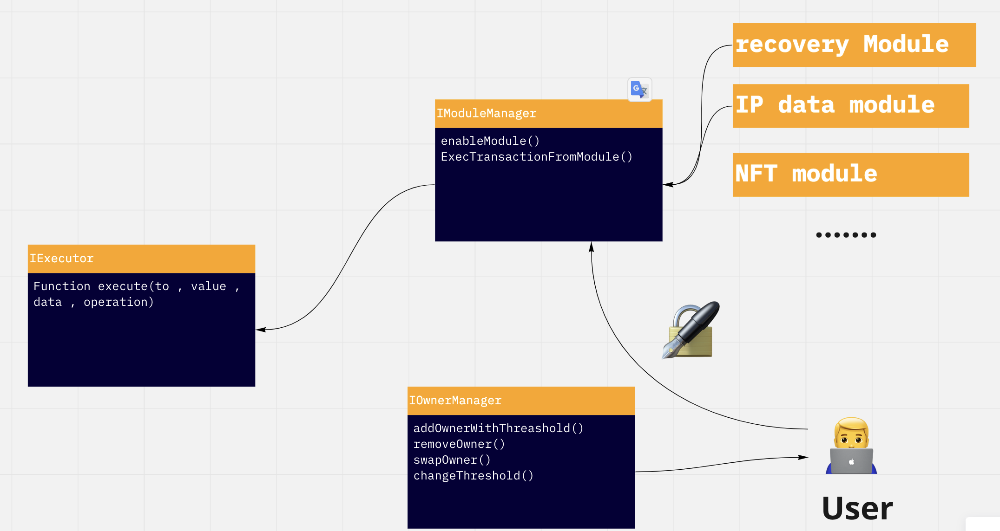
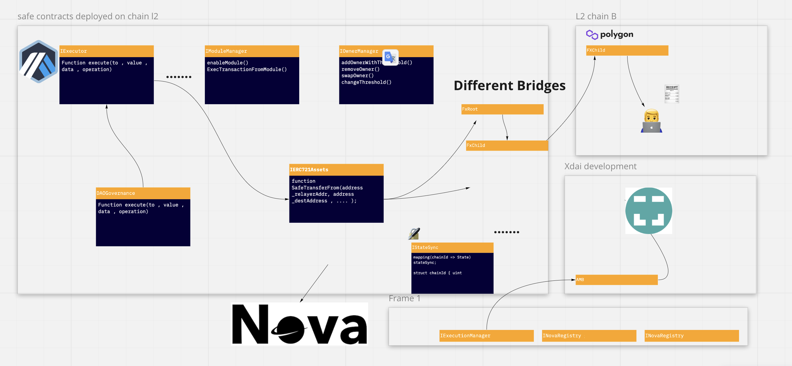

# Article on  technical specs of Gnosis-Safe and future  adoption .
## About: 

here i will be sharing the overall system design for the onchain / offchain based NFT services based on different segments : 
        - (marketplace  , metaverse , enterprise usecases ) 
        - from the persepective of adoption of current evolving standards for multisig operations 
                - 2981 for royalities standard  ,
                -  725 for the smart contract based accounts etc)  for issuing IP-NFT

- and also highlighting the challanges faced by the users in the past, something that i can also [relate](https://github.com/gnosis/safe-react/issues/350) during the previous years when due to the ascent of defi and nft applcations necessitated the need of   digital custodial  solutions to resolve the issues being faced by  the hardware / extension wallets (primarily being need of programmable accounts and security).

- and finally i will be doing the design architectures for the real use cases of the gnosis applications across different use cases (NFT ecommerce using boson with gnosis safe, crossmarket / crosschain asset transfers and custodial solution via seamless integration with rarible , opensea and  Gem etc. 

## credits :
i could not have hacked my way out writing this extensive review without referencing extensively  generous work being done by the fellow web3 community members aggregrating the resources, standards and creating communities of higher level discussion on technical design (as well as  providing inclusive enviornment so that main stakeholders in the current NFT ecosystem) so thanks a lot for your dedication. some of the prominent i am referencing here (but will be more specific for ):
    - [NFT-standards-WG](https://www.nftstandards.wtf/NFT+Standards+Wiki+-+READ.me).
    - [gitcoin kernel community](http://kernel.community/en/).
    - [Boson Protocol](http://kernel.community/en/).
    -  Gnosis safe and github repositories (and special thanks to richard messner and ayan from the gnosis team for their work).
 
## intro 101 : gnosis safe design 

Gnosis-safe is solutions provider for managing  smart contract based wallet with primarily multi-signature functionality , but at same time providing access to  varied functionalities like.
    -  building custom  transactions (like timelocks , batched transactions , fine grained access management apart from whitelisting addresses  ) for providing better UX exeperience and use cases not envisioned before .  

    - custom modules  like social recovery, access tokens to different identification token protocols (SSH , X11 ,OAUTH and sky is limit ) thanks to the modularisation based on the core use cases that are robust .
    
    - gasless transfer and adoption for paying the gas fees in other altcoins  .

the safe ecosystem provides  onchain based smart contract wallets via using [safe-contracts](https://github.com/gnosis/safe-contracts) for building Multisig transactions for any arbitrary smart contract call / token transactions , but also  corresponding [proxy relay service](https://github.com/gnosis/safe-relay-service)

this an overall suite of the usecases for   the  treasury management of the prominent DAO's (needing safe's for batch transfer of payments and NFT's ) to an normal user who just want to relay its transaction without maintaining its own safe onchain , there needs to be further expansion / explanation about the framework  that gnosis has on desposal on top of safe-contrqcts in order to implement real world use cases 

## current NFT market ecosystem and oppertunities.

the NFT's  and its corresponding ecosystem has seen much greater adoption in practical real time economical use cases apart from the craze of jpegs . [#DeSci](https://www.nature.com/articles/d41586-021-03642-9) , [dataNFT's](https://blog.oceanprotocol.com/datatokens-daos-and-nfts-14aedce1bba7) and E-commerce via BOSON  are unlocking the potential of custody of the assets mainstream . along with this comes the challange in adaptation of the required  legal and technological standards(enforcing IP and copyrights as explained in [article By Trent from ocean](https://blog.oceanprotocol.com/nfts-ip-1-practical-connections-of-erc721-with-intellectual-property-dc216aaf005d) , combining with the digital identity  etc). thus gnosis finds it as suitable candidate to be the custodian of the state of the NFT  vertical .  now coming to the analysis of the different SDK and services available and how to add new workflows in  them.

1. for instance doing analysis of  NFT's and IP use case:  for  publishing the given IP-NFT by  the safe   of the organisation / research entity   on the  baseIP asset needs to provide :
    1.Clarification of the  onchain signed data  (the metadata about the underlying asset , which is the T&C for the creation and sublicensing of the  patent to the other entity ) which the user is signing via the EIP712  standard or `execTransaction` with the multisig .  This will need the interactions with the other modules managed by [ModuleManager](https://github.com/gnosis/safe-contracts/blob/main/contracts/base/ModuleManager.sol). this will be possible with building the different modules for the use cases handling the different internal stages of the  creation of the attested NFT's.

    2. Also here the Role Based Access combined with multisig ( as it will be different from the traditional use cases of M of N signatures with equal signing power) . this will mean  modified implementation of the gnosis safe contracts multisig to adapt to the different type of governance DAO  protocols, something that [Gnosis/Zodiac]() provide the  development of modules to integrate with the DAO contracts programmably and securely with the core safe contracts functionality 
    

    3. And in end, for scalablity and also integrating the siloed database and offchain computing systems, the safe-contracts do need to integrate the approach of using  rollups (like that of starknet) which will significantly scale the transactions in the constant size and time complexicity, which has been an major issue with gnosis on mainnet currently.

## example of the workflow 
</img>

apart from the above use case, there  have been many other potential  ways of working on expanding the technical frameworks (both the SDK along with the safe-contracts) based on the upcoming standards in the NFT as follows :

- 2981 royality standard : this is an ERC standard for retriving  payment info about the original owner/ minter of the given NFT /NFT's drop in order to introduce possiblity of royality payments . this standard  although makes it standard in sharing the ledger of the NFT transaction history , but still they will not be obliged to pay on the given royality contract given that traditional ERC20 transfer functions need the approval of the transaction (in the case of the gnosis safe based multisig of artists guild or royality publishing companies). 
    -  integration of the standard function `function royalityInfo(uint256 _tokenId, uint256 _salePrice) external view returns(address receiver, uint256 royaltyAmount)` as the  relayer module on the side of the artists  , which will be approved  first time whenever the particular NFT is being minted onchain and being added to the auction.
    - then in order to determine whether the NFT in the given marketplace has implemented the necessary interface and, comparing the function signature , and then  automatically the function executeTransaction can be called by the safe to disburse to the orignal owner once the ownership is transferred between the second and third sale . this presents immense oppertunities for the applications on top of gnosis , for instance building an beacon network of bots that check the emitted events of the NFT  sales and then providing the analytics to the  initial owner whether he is getting the necessary fair share of royalities in the second and third stage of the application.
        -  either centralised services like openzeppelin-defender or the decentralised ones (forta, k3pr or gelato) can become the event driven , programmable  payments so as to have web3 monetary system that is .
        - want to transfer the royalities in term of streaming money , superfluid based module integration in making the money streams which can be transferred as function of the time of ownership by the current owner, making it more flexible to pay based on the utility of the NFT (like in the events , e-commerce asset etc). 
      

## current challanges and the future adoption challanges 

current challange in the  multichain based NFT assets are follows :
- keeping the consistency of the  NFT's across different L1/L2 via multichain based multisigs : currently although gnosis has been keeping up with the prevelant trend of the steday adoption of the applications across the diffrent chains by deploying compliant version fo safe contracts across  these chains. but this is  pretty much the analogy of the current tradfi custodial solutions . ideally allowing the transfer of the assets across chains and their validation of the transactions trustless will be the next paradigm for  building the more practical cross multichain applications that allows seamless multisig implementation without the dependency of the centralised bridges , that have significant tradeoffs  wrt the security  and  Transfer  of the assets  and the  multisig transaction calls. 

 there has been active research going on the side of the  trustless  arbitrary  cross-chain contract calls and token transfers with some of the famous examples being [AAVE crosschain bridge](https://github.com/aave/governance-crosschain-bridges) for  executing crosschain proposal execution of the AAVE DAO, [Nova](https://github.com/Rari-Capital/nova/tree/master) for  R/w transactions  from L2 to l1 provides an start for building the alternative  cross domain custodial solution bridges, while still keeping the dependency on the present bridges like chainbridge

# example workflow for cross l1 (or cross l1 <> l2 chain implementation)
</img>

the above workflow explains the  general overview of  how can the safe contracts from the single chain (primarily mainnet or the other L2 deployments ) can allow the interoperable multisig transactions by providing synchronisation of the relay transactions for  the user vault from one chain to  transfer the NFT assets across bridges, this will be  complemented by the stateSynchronisation across both sides of the state contracts . although the following schem can still be improved by  using the ZkP based frameworks , deploying trustless bridges by MPC based networks (anyswap for NFT's) which will be an great benchmark for the mass adoption of the crosschain assets trading and  trickling down the value chain from  the current inefficient model of "blitz of attracting talent natively to chain " to that of "providing feasiblity to access the user across all chains ".

and finally i will finish on the note of optimism that gnosis safe can  build the  multisig integrations  with the current web3 ecosystem by actively participating with not only  the developer communities  but also the web3 enthusiats by explaining the primitives of this amazing  technology iand how this is democratising the notion of ownership of the asset as inclusive and adaptable across different use cases as possible . given that i have been fascinated more as the persepective of "system design" , i am happy to go further ab publish in upco;inng weeks some tutorials on some of the ideas that i highlighted in the given application 

PS: please feel free to add critics and points of improvement . i indeed know that the following article is written like the brownian motion with not an correct structured narration based on the guidelines, but indeed i am fascinated  for diving into  writing  web3 infra based tutorials (specially in custodial solutions and their adoption) so hope you will take that into consideration  and will surely  consider my submission  for the bounty. 

kudos and force to gnosis team